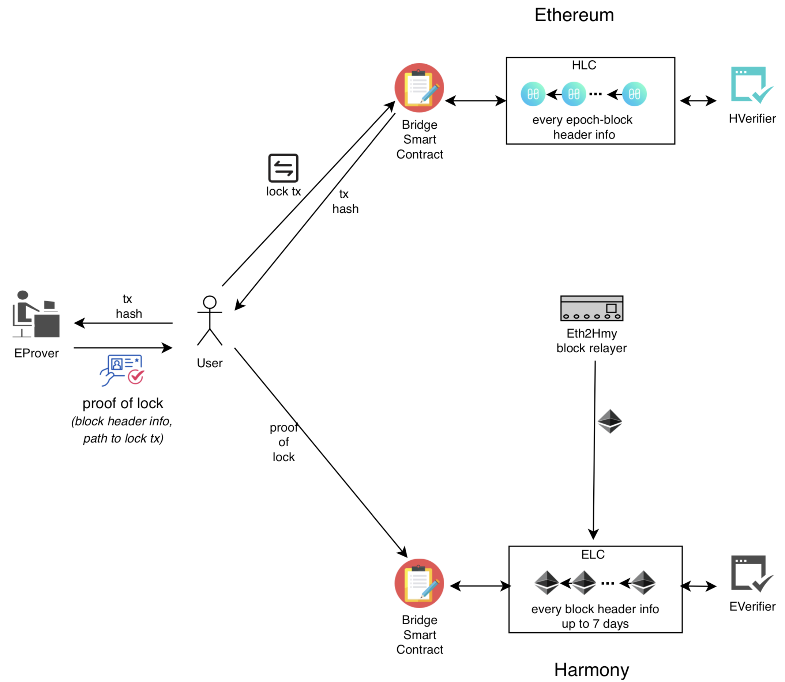

# Deep Dive On Near Bridge

**Table of Contents**

- [Deep Dive On Near Bridge](#deep-dive-on-near-bridge)
  - [John](#john)
  - [Consensus](#consensus)
    - [Ethereum 1.0 Proof Of Work](#ethereum-10-proof-of-work)
      - [Further Information](#further-information)
      - [Reference Implementations](#reference-implementations)
    - [Harmony Fast Byzantine Fault Tolerance (FBFT)](#harmony-fast-byzantine-fault-tolerance-fbft)
    - [Ethereum 2.0 Proof Of Stake](#ethereum-20-proof-of-stake)
      - [Ethereum 2.0 Attestations](#ethereum-20-attestations)
      - [Key Points](#key-points)
    - [NEAR Protocol Consensus](#near-protocol-consensus)
    - [Further Information](#further-information-1)
    - [Reference Implementations](#reference-implementations-1)
  - [Light Client Support](#light-client-support)
    - [Ethereum 1.0 Light Client (on Harmony)](#ethereum-10-light-client-on-harmony)
      - [Key Points](#key-points-1)
    - [Ethereum 2.0](#ethereum-20)
      - [Key Concepts](#key-concepts)
      - [Altair Light Client -- Sync Protocol](#altair-light-client----sync-protocol)
      - [The Portal Network](#the-portal-network)
      - [Transaction Proofs](#transaction-proofs)
      - [Further Information](#further-information-2)
    - [Harmony](#harmony)
      - [Key Core Protocol Changes Include](#key-core-protocol-changes-include)
      - [Key Light Client Components Include](#key-light-client-components-include)
      - [Sample Implementation](#sample-implementation)
      - [Further Information](#further-information-3)
    - [NEAR](#near)
  - [Relayers](#relayers)
    - [NEAR TO Ethereum](#near-to-ethereum)
      - [NEAR to Ethereum block propagation costing](#near-to-ethereum-block-propagation-costing)
      - [Bonding and Slashing](#bonding-and-slashing)
      - [NEAR to Ethereum block propagation flow](#near-to-ethereum-block-propagation-flow)
      - [NearBridge.sol](#nearbridgesol)
      - [Key Points](#key-points-2)
      - [Further Information](#further-information-4)
    - [Ethereum to NEAR](#ethereum-to-near)
      - [Light Client Every Block Header (Ethereum to NEAR)](#light-client-every-block-header-ethereum-to-near)
    - [Harmony to Ethereum](#harmony-to-ethereum)
    - [Ethereum to Harmony](#ethereum-to-harmony)
  - [Watchdogs](#watchdogs)
    - [NEAR to Ethereum watchdog](#near-to-ethereum-watchdog)
  - [Message Formatting and Serialization](#message-formatting-and-serialization)
  - [Next Steps](#next-steps)
- [APPENDICES](#appendices)
  - [APPENDIX A: Ethereum Light Client Specifications](#appendix-a-ethereum-light-client-specifications)
  - [APPENDIX B: Threat Mitigation](#appendix-b-threat-mitigation)
  - [APPENDIX C: Reference Cross Chain Communication Protocols](#appendix-c-reference-cross-chain-communication-protocols)
  - [APPENDIX D: Other Bridge Approaches](#appendix-d-other-bridge-approaches)
  - [APPENDIX E: Signing Mechanisms](#appendix-e-signing-mechanisms)
  - [APPENDIX F: Related Design Documents](#appendix-f-related-design-documents)
- [References](#references)
- [Reference Code Bases](#reference-code-bases)
  - [Core Protocol](#core-protocol)
  - [Bridges](#bridges)
  - [SDK](#sdk)
  - [Frontend](#frontend)
- [Reference images](#reference-images)


## John


**Further Information**
* [John's resume](https://johnwhitton.com/john.pdf)
* [johnwhitton.com](https://johnwhitton.com)


## Consensus

### Ethereum 1.0 Proof Of Work

> Existing Blockchain technology is working on the core concept of 'Proof Of Work' (POW). A proof-of-work (PoW) is a protocol that is difficult to compute but easy to verify. It can be verified in far less time than it took to compute in first place. The process involves scanning for a value that when hashed, (such as with SHA-256), the hash begins with a number of zero bits. The average work required is exponential in the number of zero bits required and can be verified by executing a single hash. In simple words, Proof of work is an expensive computation done by all miners to compete to find a number that, when added to the block of transactions, causes this block to hash to a code with certain rare properties. Finding such a rare number is hard (based on the cryptographic features of the hash function used in this process), but verifying its validity when it's found is relatively easy. One can take the challenge, the proof string and hash them together and check if the hash begins with a number of zero bits. This requires to apply the hash function just once and verify the output indeed has requisite numbers of 0's in front. If so, then the proof of work is considered valid under the application of that cryptographic hash function. Every block in the participating network should contain such rare number.


Block Structure from [go-ethereum](https://github.com/ethereum/go-ethereum/blob/release/1.9/consensus/ethash/consensus.go)
```
// SealHash returns the hash of a block prior to it being sealed.
func (ethash *Ethash) SealHash(header *types.Header) (hash common.Hash) {
	hasher := sha3.NewLegacyKeccak256()

	rlp.Encode(hasher, []interface{}{
		header.ParentHash,
		header.UncleHash,
		header.Coinbase,
		header.Root,
		header.TxHash,
		header.ReceiptHash,
		header.Bloom,
		header.Difficulty,
		header.Number,
		header.GasLimit,
		header.GasUsed,
		header.Time,
		header.Extra,
	})
	hasher.Sum(hash[:0])
	return hash
}
```


#### Further Information
* [Proof of Work (POW), Ethereum Org, 2022](https://ethereum.org/en/developers/docs/consensus-mechanisms/pow/)
* [Proof Of Work (POW), EtherWorld 2017](https://etherworld.co/2017/04/16/proof-of-work-pow/)
* [EIP-1057: ProgPoW, a Programmatic Proof-of-Work](https://eips.ethereum.org/EIPS/eip-1057)

#### Reference Implementations
* [consensus go-ethereum Nov 202](https://github.com/ethereum/go-ethereum/blob/release/1.9/consensus/consensus.go)
* [ethash.go, go-ethereum Nov 2020](https://github.com/ethereum/go-ethereum/blob/release/1.9/consensus/ethash/ethash.go)
* [ethash.sol, horizon 2022](https://github.com/johnwhitton/horizon/blob/refactorV2/contracts/ethash/ethash.sol)
* [ethash.rs, parity-ethereum, 2020](https://github.com/openethereum/parity-ethereum/blob/v2.7.2-stable/ethash/src/lib.rs)
* [progpow.ps, parity-ethereum, 2020](https://github.com/openethereum/parity-ethereum/blob/v2.7.2-stable/ethash/src/progpow.rs)


### Harmony Fast Byzantine Fault Tolerance (FBFT)

The following is an excerpt from [Consensus](https://docs.harmony.one/home/general/technology/consensus)
> The consensus algorithm is a key component of any blockchain. It determines the security and performance of a blockchain and is often referred to as the "engine" of a blockchain. Harmony’s consensus algorithm is called Fast Byzantine Fault Tolerance (FBFT), which is an innovative upgrade on the famous PBFT algorithm. FBFT is one order of magnitude faster and more scalable than PBFT because BLS (Boneh–Lynn–Shacham) aggregate signature is used to significantly reduce the communication cost. Specifically, FBFT allows at least 250 validators to reach consensus within 2 seconds.
> 
> For every round of consensus in FBFT, one validator serves as the “leader” and there are three phases: the announce phase, the prepare phase and the commit phase. In the announce phase, the leader proposes a new block and broadcasts the block hash to all of the validators. In the prepare phase, validators verify the message and sign on the block hash, as well as sending the signature back to the leader. The prepare phase finishes when signatures with more than 2/3 of the voting power are collected. After that, the leader aggregated the collected signatures into a O(1)-sized BLS aggregate signature and then broadcast it with the whole block to start the commit phase. The commit phase involves validators verifying the block and doing a similar signing process as the prepare phase (i.e. 2/3 voting power collection). The consensus is reached after the commit phase is done. This whole process can be done within 2 seconds in mainnet.

The following is an excerpt from [Epoch Transition](https://docs.harmony.one/home/network/validators/definitions/epoch-transition)
> An epoch is a period of time when the beacon shard (i.e. shard 0, the coordinator for other shards) produces a fixed number of blocks. In Harmony mainnet, an epoch is 32768 blocks (~18.2h with a 2s block time) in the beacon shard

*Note: If the leader fails to produce a block within a certain time frame, then a new leader is elected*


Block Structure from [harmony](https://github.com/harmony-one/harmony/blob/main/block/v3/header.go)
```
type headerFields struct {
	ParentHash          common.Hash    `json:"parentHash"       gencodec:"required"`
	Coinbase            common.Address `json:"miner"            gencodec:"required"`
	Root                common.Hash    `json:"stateRoot"        gencodec:"required"`
	TxHash              common.Hash    `json:"transactionsRoot" gencodec:"required"`
	ReceiptHash         common.Hash    `json:"receiptsRoot"     gencodec:"required"`
	OutgoingReceiptHash common.Hash    `json:"outgoingReceiptsRoot"     gencodec:"required"`
	IncomingReceiptHash common.Hash    `json:"incomingReceiptsRoot" gencodec:"required"`
	Bloom               ethtypes.Bloom `json:"logsBloom"        gencodec:"required"`
	Number              *big.Int       `json:"number"           gencodec:"required"`
	GasLimit            uint64         `json:"gasLimit"         gencodec:"required"`
	GasUsed             uint64         `json:"gasUsed"          gencodec:"required"`
	Time                *big.Int       `json:"timestamp"        gencodec:"required"`
	Extra               []byte         `json:"extraData"        gencodec:"required"`
	MixDigest           common.Hash    `json:"mixHash"          gencodec:"required"`
	// Additional Fields
	ViewID              *big.Int `json:"viewID"           gencodec:"required"`
	Epoch               *big.Int `json:"epoch"            gencodec:"required"`
	ShardID             uint32   `json:"shardID"          gencodec:"required"`
	LastCommitSignature [96]byte `json:"lastCommitSignature"  gencodec:"required"`
	LastCommitBitmap    []byte   `json:"lastCommitBitmap"     gencodec:"required"` // Contains which validator signed
	Vrf                 []byte   `json:"vrf"`
	Vdf                 []byte   `json:"vdf"`
	ShardState          []byte   `json:"shardState"`
	CrossLinks          []byte   `json:"crossLink"`
	Slashes             []byte   `json:"slashes"`
}
```


### Ethereum 2.0 Proof Of Stake

*Note: Time on Ethereum 2.0 Proof of Stake is divided into slots and epochs. One slot is 12 seconds. One epoch is 6.4 minutes, consisting of 32 slots. One block can be created for each slot.*

From [Proof of Stake, ethereum.org](https://ethereum.org/en/developers/docs/consensus-mechanisms/pos/)
> Proof-of-stake underlies certain consensus mechanisms used by blockchains to achieve distributed consensus. In proof-of-work, miners prove they have capital at risk by expending energy. Ethereum uses proof-of-stake, where validators explicitly stake capital in the form of ETH into a smart contract on Ethereum. This staked ETH then acts as collateral that can be destroyed if the validator behaves dishonestly or lazily. The validator is then responsible for checking that new blocks propagated over the network are valid and occasionally creating and propagating new blocks themselves.

Excerpt of LMD GHOST Fork-choice-rule from [Combining GHOST and Casper](https://arxiv.org/pdf/2003.03052.pdf)


Block Structure from [prysm](https://github.com/prysmaticlabs/prysm/blob/develop/consensus-types/blocks/types.go) (golang)
```
// BeaconBlockBody is the main beacon block body structure. It can represent any block type.
type BeaconBlockBody struct {
	version                int
	isBlinded              bool
	randaoReveal           [field_params.BLSSignatureLength]byte
	eth1Data               *eth.Eth1Data
	graffiti               [field_params.RootLength]byte
	proposerSlashings      []*eth.ProposerSlashing
	attesterSlashings      []*eth.AttesterSlashing
	attestations           []*eth.Attestation
	deposits               []*eth.Deposit
	voluntaryExits         []*eth.SignedVoluntaryExit
	syncAggregate          *eth.SyncAggregate
	executionPayload       *engine.ExecutionPayload
	executionPayloadHeader *engine.ExecutionPayloadHeader
}

// BeaconBlock is the main beacon block structure. It can represent any block type.
type BeaconBlock struct {
	version       int
	slot          types.Slot
	proposerIndex types.ValidatorIndex
	parentRoot    [field_params.RootLength]byte
	stateRoot     [field_params.RootLength]byte
	body          *BeaconBlockBody
}

// SignedBeaconBlock is the main signed beacon block structure. It can represent any block type.
type SignedBeaconBlock struct {
	version   int
	block     *BeaconBlock
	signature [field_params.BLSSignatureLength]byte
}
```

Eth1Data from [prysm](https://github.com/prysmaticlabs/prysm/blob/develop/proto/prysm/v1alpha1/powchain.pb.go#L24) (golang)
```
type ETH1ChainData struct {
	state         protoimpl.MessageState
	sizeCache     protoimpl.SizeCache
	unknownFields protoimpl.UnknownFields

	CurrentEth1Data   *LatestETH1Data     `protobuf:"bytes,1,opt,name=current_eth1_data,json=currentEth1Data,proto3" json:"current_eth1_data,omitempty"`
	ChainstartData    *ChainStartData     `protobuf:"bytes,2,opt,name=chainstart_data,json=chainstartData,proto3" json:"chainstart_data,omitempty"`
	BeaconState       *BeaconState        `protobuf:"bytes,3,opt,name=beacon_state,json=beaconState,proto3" json:"beacon_state,omitempty"`
	Trie              *SparseMerkleTrie   `protobuf:"bytes,4,opt,name=trie,proto3" json:"trie,omitempty"`
	DepositContainers []*DepositContainer `protobuf:"bytes,5,rep,name=deposit_containers,json=depositContainers,proto3" json:"deposit_containers,omitempty"`
}

type LatestETH1Data struct {
	state         protoimpl.MessageState
	sizeCache     protoimpl.SizeCache
	unknownFields protoimpl.UnknownFields

	BlockHeight        uint64 `protobuf:"varint,2,opt,name=block_height,json=blockHeight,proto3" json:"block_height,omitempty"`
	BlockTime          uint64 `protobuf:"varint,3,opt,name=block_time,json=blockTime,proto3" json:"block_time,omitempty"`
	BlockHash          []byte `protobuf:"bytes,4,opt,name=block_hash,json=blockHash,proto3" json:"block_hash,omitempty"`
	LastRequestedBlock uint64 `protobuf:"varint,5,opt,name=last_requested_block,json=lastRequestedBlock,proto3" json:"last_requested_block,omitempty"`
}
```

BeaconBlockAltair from [lighthouse](https://github.com/sigp/lighthouse/blob/stable/consensus/types/src/beacon_block.rs#L407) rust
```
    /// Return an Altair block where the block has maximum size.
    pub fn full(spec: &ChainSpec) -> Self {
        let base_block: BeaconBlockBase<_, Payload> = BeaconBlockBase::full(spec);
        let sync_aggregate = SyncAggregate {
            sync_committee_signature: AggregateSignature::empty(),
            sync_committee_bits: BitVector::default(),
        };
        BeaconBlockAltair {
            slot: spec.genesis_slot,
            proposer_index: 0,
            parent_root: Hash256::zero(),
            state_root: Hash256::zero(),
            body: BeaconBlockBodyAltair {
                proposer_slashings: base_block.body.proposer_slashings,
                attester_slashings: base_block.body.attester_slashings,
                attestations: base_block.body.attestations,
                deposits: base_block.body.deposits,
                voluntary_exits: base_block.body.voluntary_exits,
                sync_aggregate,
                randao_reveal: Signature::empty(),
                eth1_data: Eth1Data {
                    deposit_root: Hash256::zero(),
                    block_hash: Hash256::zero(),
                    deposit_count: 0,
                },
                graffiti: Graffiti::default(),
                _phantom: PhantomData,
            },
        }
    }
}
```

#### Ethereum 2.0 Attestations

From [Attestations, ethereum.org](https://ethereum.org/en/developers/docs/consensus-mechanisms/pos/attestations)
> Every epoch (6.4 minutes) a validator proposes an attestation to the network. The attestation is for a specific slot in the epoch. The purpose of the attestation is to vote in favor of the validator's view of the chain, in particular the most recent justified block and the first block in the current epoch (known as source and target checkpoints). This information is combined for all participating validators, enabling the network to reach consensus about the state of the blockchain.
> 
> The attestation contains the following components:
> * aggregation_bits: a bitlist of validators where the position maps to the validator index in their committee; the value (0/1) indicates whether the validator signed the data (i.e. whether they are active and agree with the block proposer)
> * data: details relating to the attestation, as defined below
> * signature: a BLS signature that aggregates the signatures of individual validators
>
> The first task for an attesting validator is to build the data. The data contains the following information:
> * slot: The slot number that the attestation refers to
> * index: A number that identifies which committee the validator belongs to in a given slot
> * beacon_block_root: Root hash of the block the validator sees at the head of the chain (the result of applying the fork-choice algorithm)
> * source: Part of the finality vote indicating what the validators see as the most recent justified block
> * target: Part of the finality vote indicating what the validators see as the first block in the current epoch
> 
> Once the data is built, the validator can flip the bit in aggregation_bits corresponding to their own validator index from 0 to 1 to show that they participated.
>
> Finally, the validator signs the attestation and broadcasts it to the network.


#### Key Points
* Use of BLS Signatures
* Validators provide attestations per epoch
* LMD GHOST Fork Rule choses the correct epoch
* `aggregation_bits` provides a very concise way to know which validators have agreed with the block proposer

### NEAR Protocol Consensus

Please see [Consensus, NEAR Nomicon](https://nomicon.io/ChainSpec/Consensus)

### Further Information
* [Proof of Stake (POS), Ethereum Org, 2022](https://ethereum.org/en/developers/docs/consensus-mechanisms/pos/)
* [Proof of Stake, Vitalik, 2017](https://vitalik.ca/general/2017/12/31/pos_faq.html)
* [Combining GHOST and Casper](https://arxiv.org/pdf/2003.03052.pdf)
* [Consensus, Harmony, 2022](https://docs.harmony.one/home/general/technology/consensus)
* [Consensus, NEAR Nomicon](https://nomicon.io/ChainSpec/Consensus)


### Reference Implementations
* [consensus, Harmony](https://github.com/harmony-one/harmony/tree/main/consensus)
* [Mountain Merkle Range Support, Harmony](https://github.com/harmony-one/harmony/pull/4198)
* [Ethereum 2.0, Prysm](https://github.com/prysmaticlabs/prysm)
* [Ethereum 2.0, LightHouse (sigp)](https://github.com/sigp/lighthouse)
* [Ethereum 2.0, LightHouse consensus client (auror-is-near)](https://github.com/sigp/lighthouse)
* [NEAR blockchain core, (near)](https://github.com/near/nearcore)
https://github.com/near/nearcore
* BLS [Boneh–Lynn–Shacham](https://en.wikipedia.org/wiki/BLS_digital_signature) implementations
  * [bls Harmony](https://github.com/harmony-one/bls) forked from [herumi/bls_](https://github.com/herumi/bls_): written in C++, supports Go, Rust, WebAssembly (Node.js)
  * [bls Ethereum 2.0 Prysm](https://github.com/prysmaticlabs/prysm/blob/develop/crypto/bls/bls.go) built using [herumi/bls-eth-go-binary](https://github.com/herumi/bls-eth-go-binary/)
  * [bls Ethereum 2.0 Lighthouse](https://github.com/aurora-is-near/lighthouse/tree/stable/crypto/bls) built natively in rust. Supports
      * [impls](https://github.com/aurora-is-near/lighthouse/tree/stable/crypto/bls/src/impls): Implementations
          * [blst](https://github.com/aurora-is-near/lighthouse/blob/stable/crypto/bls/src/impls/blst.rs)
          * [fake_crypto](https://github.com/aurora-is-near/lighthouse/blob/stable/crypto/bls/src/impls/fake_crypto.rs)
          * [milagro](https://github.com/aurora-is-near/lighthouse/blob/stable/crypto/bls/src/impls/milagro.rs): support for [Apache Milagro](https://milagro.apache.org/docs/milagro-intro/)


## Light Client Support
### Ethereum 1.0 Light Client (on Harmony)

**Design**
Existing Design
1. DAG is generated for each Ethereum EPOCH: This takes a couple of hours and has a size of approx 1GB.
2. Relayer is run to replicate each block header to the SPV Client on Harmony.
3. EthereumLightClient.sol addBlockHeader: Adds each block header to the Ethereum Light Client.
4. Transactions are Verified

**Running the Relayer**
```
# Start the relayer (note: replace the etherum light client address below)
# relay [options] <ethUrl> <hmyUrl> <elcAddress>   relay eth block header to elc on hmy
 yarn cli ethRelay relay http://localhost:8645 http://localhost:9500 0x3Ceb74A902dc5fc11cF6337F68d04cB834AE6A22
 ```

**Implementation**
1. DAG Generation can be done explicity by calling `dagProve` from the CLI or it is done automatically by `getHeaderProof` in `ethHashProof/BlockProof.js` which is called from `blockRelay` in `cli/ethRelay.js`.
2. Relaying of Block Headers is done by `blockRelayLoop` in `cli/ethRelay.js` which
    * Reads the last block header from EthereumLightClient.sol
    * Loops through calling an Ethereum RPC per block to retrieve the blockHeader using ` return eth.getBlock(blockNo).then(fromRPC)` in function `getBlockByNumber` in `eth2hmy-relay/getBlockHeader.js`
3. Adding BlockHeaders is done by `await elc.addBlockHeader(rlpHeader, proofs.dagData, proofs.proofs)` which is called from `cli/ethRelay.js`. `addBlockHeader` in `EthereumLightClient.sol` 
    * calculates the blockHeader Hash 
    * and checks that it 
        * hasn't already been relayed,
        * is the next block to be added,
        * has a valid timestamp 
        * has a valid difficulty  
        * has a valid Proof of Work (POW)
    * Check if the canonical chain needs to be replaced by another fork

#### Key Points
* Uses EthHash Function which has been implemented in go, rust and solidity.
* DAG Generation for an Epoch is done up front (see [DagProof.js](https://github.com/johnwhitton/horizon/blob/refactorV2/src/eth2hmy-relay/lib/DagProof.js)) takes a couple of hours (code can be optimized) generates a merkle tree uses about 2GB.
* Forks are possible so finality takes longer
  *  Harmony Horizon Bridge waited for 25 blocks to be verified (see [EthereumLightClient.sol isVerified](https://github.com/johnwhitton/horizon/blob/refactorV2/contracts/EthereumLightClient.sol#L248))
        * `return canonicalBlocks[blockHash] && blocks[blockHash].number + 25 < blocks[canonicalHead].number;`
   * Harmony Horizon Bridge waited for 200 blocks to be finalized (see [EthereumLightClient.sol isFinalized](https://github.com/johnwhitton/horizon/blob/refactorV2/contracts/EthereumLightClient.sol#L257) )
       * `return canonicalBlocks[blockHash] && blocks[blockHash].number + 200 < blocks[canonicalHead].number;`


### Ethereum 2.0

#### Key Concepts
* Syncing to Current state
* Advancing Blocks
* Communication can be either via
    * RPC to the [Eth BEACON Node API](https://ethereum.github.io/beacon-APIs/#/Beacon)
    * [Networking Gossip Topics](https://github.com/ethereum/consensus-specs/blob/dev/specs/altair/light-client/p2p-interface.md#global-topics)
        * [light_client_finality_update](https://github.com/ethereum/consensus-specs/blob/dev/specs/altair/light-client/p2p-interface.md#light_client_finality_update): This topic is used to propagate the latest `LightClientFinalityUpdate` to light clients, allowing them to keep track of the latest `finalized_header`.
        * [light_client_optimistic_update](https://github.com/ethereum/consensus-specs/blob/dev/specs/altair/light-client/p2p-interface.md#light_client_optimistic_update): This topic is used to propagate the latest`LightClientOptimisticUpdate` to light clients, allowing them to keep track of the latest `optimistic_header`.


*Note: Time on Ethereum 2.0 Proof of Stake is divided into slots and epochs. One slot is 12 seconds. One epoch is 6.4 minutes, consisting of 32 slots. One block can be created for each slot.*


#### Altair Light Client -- Sync Protocol
* [Altair Light Client -- Sync Protocol](https://github.com/ethereum/consensus-specs/blob/dev/specs/altair/light-client/sync-protocol.md): The beacon chain is designed to be light client friendly for constrained environments to access Ethereum with reasonable safety and liveness.

    Such environments include resource-constrained devices (e.g. phones for trust-minimized wallets)and metered VMs (e.g. blockchain VMs for cross-chain bridges).

    This document suggests a minimal light client design for the beacon chain thatuses sync committees introduced in [this beacon chain extension](https://github.com/ethereum/consensus-specs/blob/dev/specs/altair/beacon-chain.md).

    Additional documents describe how the light client sync protocol can be used:
    - [Full node](https://github.com/ethereum/consensus-specs/blob/dev/specs/altair/light-client/full-node.md)
    - [Light client](https://github.com/ethereum/consensus-specs/blob/dev/specs/altair/light-client/light-client.md)
    - [Networking](https://github.com/ethereum/consensus-specs/blob/dev/specs/altair/light-client/p2p-interface.md)

* [Light client sync process](https://github.com/ethereum/consensus-specs/blob/dev/specs/altair/light-client/light-client.md): explains how light clients MAY obtain light client data to sync with the network.

    1. The light client MUST be configured out-of-band with a spec/preset (including fork schedule), with `genesis_state` (including `genesis_time` and `genesis_validators_root`), and with a trusted block root. The trusted block SHOULD be within the weak subjectivity period, and its root SHOULD be from a finalized `Checkpoint`.
    2. The local clock is initialized based on the configured `genesis_time`, and the current fork digest is determined to browse for and connect to relevant light client data providers.
    3. The light client fetches a [`LightClientBootstrap`](https://github.com/ethereum/consensus-specs/blob/dev/specs/altair/light-client/light-client.md) object for the configured trusted block root. The `bootstrap` object is passed to [`initialize_light_client_store`](https://github.com/ethereum/consensus-specs/blob/dev/specs/altair/light-client/sync-protocol.md#initialize_light_client_store) to obtain a local [`LightClientStore`](https://github.com/ethereum/consensus-specs/blob/dev/specs/altair/light-client/sync-protocol.md#lightclientstore).
    4. The light client tracks the sync committee periods `finalized_period` from `store.finalized_header.slot`, `optimistic_period` from `store.optimistic_header.slot`, and `current_period` from `current_slot` based on the local clock.
        1. When `finalized_period == optimistic_period` and [`is_next_sync_committee_known`](https://github.com/ethereum/consensus-specs/blob/dev/specs/altair/light-client/sync-protocol.md#is_next_sync_committee_known) indicates `False`, the light client fetches a [`LightClientUpdate`](https://github.com/ethereum/consensus-specs/blob/dev/specs/altair/light-client/sync-protocol.md#lightclientupdate) for `finalized_period`. If `finalized_period == current_period`, this fetch SHOULD be scheduled at a random time before `current_period` advances.
        2. When `finalized_period + 1 < current_period`, the light client fetches a `LightClientUpdate` for each sync committee period in range `[finalized_period + 1, current_period)` (current period excluded)
        3. When `finalized_period + 1 >= current_period`, the light client keeps observing [`LightClientFinalityUpdate`](https://github.com/ethereum/consensus-specs/blob/dev/specs/altair/light-client/sync-protocol.md#lightclientfinalityupdate) and [`LightClientOptimisticUpdate`](https://github.com/ethereum/consensus-specs/blob/dev/specs/altair/light-client/sync-protocol.md#lightclientoptimisticupdate). Received objects are passed to [`process_light_client_finality_update`](https://github.com/ethereum/consensus-specs/blob/dev/specs/altair/light-client/sync-protocol.md#process_light_client_finality_update) and [`process_light_client_optimistic_update`](https://github.com/ethereum/consensus-specs/blob/dev/specs/altair/light-client/sync-protocol.md#process_light_client_optimistic_update). This ensures that `finalized_header` and `optimistic_header` reflect the latest blocks.
    5. [`process_light_client_store_force_update`](https://github.com/ethereum/consensus-specs/blob/dev/specs/altair/light-client/sync-protocol.md#process_light_client_store_force_update) MAY be called based on use case dependent heuristics if light client sync appears stuck. If available, falling back to an alternative syncing mechanism to cover the affected sync committee period is preferred.


#### The Portal Network
* [The Portal Network](https://github.com/ethereum/portal-network-specs): The Portal Network is an in progess effort to enable lightweight protocol access by resource constrained devices.  The term *"portal"* is used to indicate that these networks provide a *view* into the protocol but are not critical to the operation of the core Ethereum protocol.

    The Portal Network is comprised of multiple peer-to-peer networks which together provide the data and functionality necessary to expose the standard [JSON-RPC API](https://eth.wiki/json-rpc/API).  These networks are specially designed to ensure that clients participating in these networks can do so with minimal expenditure of networking bandwidth, CPU, RAM, and HDD resources.

    The term 'Portal Client' describes a piece of software which participates in these networks. Portal Clients typically expose the standard JSON-RPC API.


    * Motivation: The Portal Network is focused on delivering reliable, lightweight, and decentralized access to the Ethereum protocol.

    * Prior Work on the "Light Ethereum Subprotocol" (LES): The term "light client" has historically refered to a client of the existing [DevP2P](https://github.com/ethereum/devp2p/blob/master/rlpx.md) based [LES](https://github.com/ethereum/devp2p/blob/master/caps/les.md) network.  This network is designed using a client/server architecture.  The LES network has a total capacity dictated by the number of "servers" on the network.  In order for this network to scale, the "server" capacity has to increase.  This also means that at any point in time the network has some total capacity which if exceeded will cause service degradation across the network.  Because of this the LES network is unreliable when operating near capacity.


* Block Relay
    * [Beacon State](https://github.com/ethereum/portal-network-specs/blob/master/beacon-chain/beacon-state-network.md#dht-overview): A client has a trusted beacon state root, and it wants to access some parts of the state. Each of the access request corresponds to some leave nodes of the beacon state. The request is a content lookup on a DHT. The response is a Merkle proof.

        A Distributed Hash Table (DHT) allows network participants to have retrieve data on-demand based on a content 
    * [Syncing Block Headers](https://github.com/ethereum/portal-network-specs/blob/master/beacon-chain/sync-gossip.md): A beacon chain client could sync committee to perform state updates. The data object LightClientSkipSyncUpdate allows a client to quickly sync to a recent header with the appropriate sync committee. Once the client establishes a recent header, it could sync to other headers by processing LightClientUpdates. These two data types allow a client to stay up-to-date with the beacon chain.
         * [Sync State](https://github.com/ethereum/portal-network-specs/blob/master/beacon-chain/skip-sync-network.md): A client uses SkipSyncUpdate to skip sync from a known header to a recent header. A client with a trusted but outdated header cannot use the messages in the gossip channel bc-light-client-update to update. The client's sync-committee in the stored snapshot is too old and not connected to any update messages. The client look for the appropriate SkipSyncUpdate to skip sync its header.
        * [Advance Block Headers](https://github.com/ethereum/portal-network-specs/blob/master/beacon-chain/sync-gossip.md): A beacon chain client could sync committee to perform [state updates](https://github.com/ethereum/consensus-specs/blob/dev/specs/altair/sync-protocol.md). The data object [LightClientSkipSyncUpdate](skip-sync-network) allows a client to quickly sync to a recent header with the appropriate sync committee. Once the client establishes a recent header, it could sync to other headers by processing [LightClientUpdates](https://github.com/ethereum/consensus-specs/blob/dev/specs/altair/sync-protocol.md#lightclientupdate). These two data types allow a client to stay up-to-date with the beacon chain.

            These two data types are placed into separate sub-networks. A light client make find-content requests on `skip-sync-network` at start of the sync to get a header with the same `SyncCommittee` object as in the current sync period. The client uses messages in the gossip topic `bc-light-client-update` to advance its header.

            The gossip topics described in this document is part of a [proposal](https://ethresear.ch/t/a-beacon-chain-light-client-proposal/11064) for a beacon chain light client.

#### Transaction Proofs
* [Retrieving Beacon State](https://github.com/ethereum/portal-network-specs/blob/master/beacon-chain/beacon-state-network.md): A client has a trusted beacon state root, and it wants to access some parts of the state. Each of the access request corresponds to some leave nodes of the beacon state. The request is a content lookup on a DHT. The response is a Merkle proof.

    A Distributed Hash Table (DHT) allows network participants to have retrieve data on-demand based on a content key. A portal-network DHT is different than a traditional one in that each participant could selectively limit its workload by choosing a small interest radius r. A participants only process messages that are within its chosen radius boundary.
    * [Wire Protocol](https://github.com/ethereum/portal-network-specs/blob/master/beacon-chain/beacon-state-network.md#wire-protocol): For a subprotocol, we need to further define the following to be able to instantiate the wire format of each message type.
        1. `content_key`
        2. `content_id` 
        3. `payload`

        The content of the message is a Merkle proof contains multiple leave nodes for a [BeaconState](https://github.com/ethereum/consensus-specs/blob/dev/specs/altair/beacon-chain.md#beaconstate).

        Finally, we define the necessary encodings. A light client only knows the root of the beacon state. The client wants to know the details of some leave nodes. The client has to be able to construct the `content_key` only knowing the root and which leave nodes it wants see. The `content_key` is the ssz serialization of the paths. The paths represent the part of the beacon state that one wants to know about. The paths are represented by generalized indices. Note that `hash_tree_root` and `serialize` are the same as those defined in [sync-gossip](https://github.com/ethereum/portal-network-specs/blob/master/beacon-chain/sync-gossip.md). 
    
* TODO: Review of Retrieving a transaction proof not just retrieving data on-demand

#### Further Information
* [Ethereum 2.0 Light Client Support](./ETH2_0.md#ethereum-20-light-client-support)
* Ethereum 2.0 Specifications
    * [Beacon Chain Specification](https://github.com/ethereum/consensus-specs/blob/master/specs/phase0/beacon-chain.md)
    * [Extended light client protocol](https://notes.ethereum.org/@vbuterin/extended_light_client_protocol)
    * [Altair Light Client -- Light Client](https://github.com/ethereum/consensus-specs/blob/dev/specs/altair/light-client/light-client.md)
    * [Altair Light Client -- Sync Protocol](https://github.com/ethereum/consensus-specs/blob/dev/specs/altair/light-client/sync-protocol.md)
    * [Beacon Chain Fork Choice](https://github.com/ethereum/consensus-specs/blob/dev/specs/phase0/fork-choice.md)
    * [The Portal Network Specification](https://github.com/ethereum/portal-network-specs): an in progess effort to enable lightweight protocol access by resource constrained devices.
* [Light Ethereum Subprotocol (LES)](https://github.com/ethereum/devp2p/blob/master/caps/les.md): the protocol used by "light" clients, which only download block headers as they appear and fetch other parts of the blockchain on-demand. 
* [BlockDaemon: Ethereum Altair Hard Folk: Light Clients & Sync Committees](https://blockdaemon.com/blog/ethereum-altair-hard-folk-light-clients-sync-committees/)
* [Efficient algorithms for CBC Casper](https://docs.google.com/presentation/d/1oc_zdywOsHxz3zez1ILAgrerS7RkaF1hHoW0FLtp0Gw/edit#slide=id.p): Review of LMD GHOST (Latest Message Driven, Greediest Heaviest Observed Sub-Tree)
* [SSZ: Simple Serialize](https://ethereum.org/en/developers/docs/data-structures-and-encoding/ssz/): Overview of Simple serialize (SSZ) is the serialization method used on the Beacon Chain. (including merkalization and multiproofs)
* [The Noise Protocol Framework](https://noiseprotocol.org/noise.html): Noise is a framework for crypto protocols based on Diffie-Hellman key agreement. 
* [Flashbots for Ethereum Consensus Clients](https://hackmd.io/QoLwVQf3QK6EiVt15YOYqQ?view)
* [Optimistic Sync Specification](https://github.com/ethereum/consensus-specs/blob/dev/sync/optimistic.md): Optimistic Sync is a stop-gap measure to allow execution nodes to sync via established methods until future Ethereum roadmap items are implemented (e.g., statelessness).
* [Consensus Light Client Server Implementation Notes](https://hackmd.io/hsCz1G3BTyiwwJtjT4pe2Q?view): How  Lodestar beacon node was tweaked to serve light clients
* [beacon chain light client design doc](https://notes.ethereum.org/@ralexstokes/HJxDMi8vY): notes about the design/implementation of a beacon chain light client using standard APIs and protocol features 
* [A Beacon Chain Light Client Proposal](https://ethresear.ch/t/a-beacon-chain-light-client-proposal/11064): proposing a light client implementation that goes a step further than the minimum light client described in the altair consensus-spec. The proposed client aims to allow queries into the beacon state.
* [Distributed Hash Table (DHT) Overview](https://github.com/ethereum/portal-network-specs/blob/master/beacon-chain/beacon-state-network.md#dht-overview): allows network participants to have retrieve data on-demand based on a content key.
* [(WIP) Light client p2p interface Specification](https://github.com/ethereum/consensus-specs/pull/2786): a PR to get the conversation going about a p2p approach.
Here we cover two approaches which may be combined

### Harmony
Harmony [MMR PR Review](https://github.com/harmony-one/harmony/pull/3872) and [latest PR](https://github.com/harmony-one/harmony/pull/4198/files) uses Merkle Mountain Ranges to facilitate light client development against Harmony's sharded Proof of Stake Chain.

#### Key Core Protocol Changes Include
Block Structure from [harmony](https://github.com/peekpi/harmony/blob/mmrHardfork/block/v4/header.go) with [Merkle Mountain Range](https://docs.grin.mw/wiki/chain-state/merkle-mountain-range/) support [Mmr hardfork](https://github.com/harmony-one/harmony/pull/3872) [PR 4198](https://github.com/harmony-one/harmony/pull/4198) introduces `MMRoot`

GOAL: Allow verificatin that previous blocks were valid based on the MMRRoot Passed.

Features
* add receipt proof
* adding MMRRoot field to block header & cross-chain epoch
* add memdb and filedb mmr processing logic
* add GetProof rpc
* relayer rpcs for fetching full header
* adding block signers for rpc response, debug-only
* minor testing bls
* fix merge conflicts
* github.com/zmitton/go-merklemountainrange dependency
* minor fix
* moving mmr root compute/update logic to after the shard state is computed
* fix getting siblings bug
* adding index to mmr-proof and GetProof with respect to a block number
* check if mmr directory exists, if not create it first
* fixing failing test
* fixing config build test failure
* fixing more test failures
* cleanup
* turn of signers
* fix header copy issue and write mmr root directly to node.worker header
* fix nil pointer problems, shard state fetch issue, and refIndex bug
* clean up
```
type headerFields struct {
	ParentHash          common.Hash    `json:"parentHash"       gencodec:"required"`
	Coinbase            common.Address `json:"miner"            gencodec:"required"`
	Root                common.Hash    `json:"stateRoot"        gencodec:"required"`
	TxHash              common.Hash    `json:"transactionsRoot" gencodec:"required"`
	ReceiptHash         common.Hash    `json:"receiptsRoot"     gencodec:"required"`
	OutgoingReceiptHash common.Hash    `json:"outgoingReceiptsRoot"     gencodec:"required"`
	IncomingReceiptHash common.Hash    `json:"incomingReceiptsRoot" gencodec:"required"`
	Bloom               ethtypes.Bloom `json:"logsBloom"        gencodec:"required"`
	Number              *big.Int       `json:"number"           gencodec:"required"`
	GasLimit            uint64         `json:"gasLimit"         gencodec:"required"`
	GasUsed             uint64         `json:"gasUsed"          gencodec:"required"`
	Time                *big.Int       `json:"timestamp"        gencodec:"required"`
	Extra               []byte         `json:"extraData"        gencodec:"required"`
	MixDigest           common.Hash    `json:"mixHash"          gencodec:"required"`
	// Additional Fields
	ViewID              *big.Int    `json:"viewID"           gencodec:"required"`
	Epoch               *big.Int    `json:"epoch"            gencodec:"required"`
	ShardID             uint32      `json:"shardID"          gencodec:"required"`
	LastCommitSignature [96]byte    `json:"lastCommitSignature"  gencodec:"required"`
	LastCommitBitmap    []byte      `json:"lastCommitBitmap"     gencodec:"required"` // Contains which validator signed
	Vrf                 []byte      `json:"vrf"`
	Vdf                 []byte      `json:"vdf"`
	ShardState          []byte      `json:"shardState"`
	CrossLinks          []byte      `json:"crossLink"`
	Slashes             []byte      `json:"slashes"`
	MMRRoot             common.Hash `json:"mmrRoot"`
}
```

#### Key Light Client Components Include
* [TokenLockerOnEthereum.sol](https://github.com/johnwhitton/horizon/blob/refactorV2/contracts/TokenLockerOnEthereum.sol) which has the following imports
    * [HarmonyLightClient.sol](https://github.com/johnwhitton/horizon/blob/refactorV2/contracts/HarmonyLightClient.sol): Used for Block Propogation
    * [MMRVerifier.sol](https://github.com/johnwhitton/horizon/blob/refactorV2/contracts/lib/MMRVerifier.sol): verifies that the given value exists in the tree or reverts the transaction. 
        * `function inclusionProof(bytes32 root, uint256 width, uint256 index, bytes32 value32, bytes32[] memory peaks, bytes32[] memory siblings) internal pure returns (bool)`
    * [HarmonyProver.sol](https://github.com/johnwhitton/horizon/blob/refactorV2/contracts/HarmonyProver.sol): Is largeley based of [Ethereum State Bridge developed by pipeos-one](https://github.com/pipeos-one/goldengate/blob/master/contracts/contracts/Prover.sol) has get, to and verify functions. Verify functions include
        * `function verifyTrieProof(MerkleProof memory data) internal pure returns (bytes memory)`
        * `function verifyHeader(HarmonyParser.BlockHeader memory header, MMRVerifier.MMRProof memory proof) internal pure returns (bool valid, string memory reason)`
        * `function verifyTransaction(HarmonyParser.BlockHeader memory header, MerkleProof memory txdata) internal pure returns (bytes memory serializedTx)`
        * `function verifyReceipt(HarmonyParser.BlockHeader memory header, MerkleProof memory receiptdata)`
        * `function verifyAccount(HarmonyParser.BlockHeader memory header, MerkleProof memory accountdata)`
        * `function verifyLog(MerkleProof memory receiptdata, uint256 logIndex)`
        * `function verifyTransactionAndStatus(HarmonyParser.BlockHeader memory header, MerkleProof memory receiptdata)`
        * `function verifyCode(HarmonyParser.BlockHeader memory header,MerkleProof memory accountdata)`
        * `function verifyStorage(MerkleProof memory accountProof, MerkleProof memory storageProof)`
    * [TokenLocker.sol](https://github.com/johnwhitton/horizon/blob/refactorV2/contracts/TokenLocker.sol): whose main function is to execute corresponding transactions based on transactions that occured on the other side of the bridge
        * `function execute(bytes memory rlpdata) internal returns (uint256 events)`


#### Sample Implementation

* gets the proof of the transaction on Harmony via `getProof` calling `prover.ReceiptProof` which calls the eprover and returns `proof` with 
    * `hash: sha3(resp.header.serialize()),`
    * `root: resp.header.receiptRoot,`
    * `proof: encode(resp.receiptProof),`
    * `key: encode(Number(resp.txIndex)) // '0x12' => Nunmber`
* We then call `dest.ExecProof(proof)` to execute the proof on Ethereum
    * This calls `validateAndExecuteProof` on `TokenLokerOnEthereum.sol` with the `proofData` from above, which
        * `require(lightclient.isValidCheckPoint(header.epoch, mmrProof.root),` implemented by `HarmonyLightClient.sol`
            * `return epochMmrRoots[epoch][mmrRoot]` which means that the epoch has to have had a checkpoint submitted via ` submitCheckpoint` 
        * `bytes32 blockHash = HarmonyParser.getBlockHash(header);` gets the blockHash implemented by `HarmonyParser.sol`  
            * This returns `return keccak256(getBlockRlpData(header));`  
            * `getBlockRlpData`  creates a list `bytes[] memory list = new bytes[](15);` and uses statements like `list[0] = RLPEncode.encodeBytes(abi.encodePacked(header.parentHash));` to perform [Recursive-Length Prefix (RLP) Serialization](https://ethereum.org/en/developers/docs/data-structures-and-encoding/rlp/) implemented by `RLPEncode.sol`
        *  `HarmonyProver.verifyHeader(header, mmrProof);` verifys the header implemented by `HarmonyProver.sol`
            * `bytes32 blockHash = HarmonyParser.getBlockHash(header);` gets the blockHash implemented by `HarmonyParser.sol` as above
            * `valid = MMRVerifier.inclusionProof(proof.root, proof.width, proof.index, blockHash, proof.peaks, proof.siblings);` verifys the proff using the [Merkle Mountain Range Proof](https://github.com/opentimestamps/opentimestamps-server/blob/master/doc/merkle-mountain-range.md) passed `MMRVerifier.MMRProof memory proof` and the `blockHash`.
            * **NOTE: This means that a `submitCheckpoint` in `HarmonyLightClient.sol` needs to have called either for the next epoch or for a checkpoint, after the block the harmony mapping transaction was in.**
            * **NOTE: Automatic submission of checkpoints to the Harmony Light Client has not been developed as yet. (It is not part of the `ethRelay.js`). And so the checkpoint would need to be manually submitted before the Ethereum Mapping could take place.**
        * `require(spentReceipt[receiptHash] == false, "double spent!");` ensure that we haven't already processed this mapping request`
        * `HarmonyProver.verifyReceipt(header, receiptdata)` ensure the receiptdata is valid
        * `spentReceipt[receiptHash] = true;` marks the receipt as having been processed
        * `execute(receiptdata.expectedValue);` implemented by `TokenLocker.sol` which calls `onTokenMapAckEvent(topics)` implemented by `TokenRegistry.sol` 
            * `address tokenReq = address(uint160(uint256(topics[1])));`
            * `address tokenAck = address(uint160(uint256(topics[2])));`
            * `require(TxMapped[tokenReq] == address(0), "missing mapping to acknowledge");`
            * `TxMapped[tokenReq] = tokenAck;`
            * `TxMappedInv[tokenAck] = IERC20Upgradeable(tokenReq);`
            * `TxTokens.push(IERC20Upgradeable(tokenReq));`

#### Further Information

* [DagProof.js, Harmony 2022](https://github.com/johnwhitton/horizon/blob/refactorV2/src/eth2hmy-relay/lib/DagProof.js))
* [Horizon Smart Contracts](https://github.com/johnwhitton/horizon/blob/refactorV2/docs/inheritance-graph.png)

* [Merkle Mountain Ranges (MMR), Grin Documentation, 2022](https://docs.grin.mw/wiki/chain-state/merkle-mountain-range/)

### NEAR

[NEAR Light Client Documentation](https://nomicon.io/ChainSpec/LightClient) gives an overview of how light clients work. At a high level the light client needs to fetch at least one block per [epoch](https://docs.near.org/concepts/basics/epoch) i.e. every 42,200 blocks or approxmiately 12 hours. Also Having the LightClientBlockView for block B is sufficient to be able to verify any statement about state or outcomes in any block in the ancestry of B (including B itself).

> The RPC returns the LightClientBlock for the block as far into the future from the last known hash as possible for the light client to still accept it. Specifically, it either returns the last final block of the next epoch, or the last final known block. If there's no newer final block than the one the light client knows about, the RPC returns an empty result.
>
> A standalone light client would bootstrap by requesting next blocks until it receives an empty result, and then periodically request the next light client block.
>
> A smart contract-based light client that enables a bridge to NEAR on a different blockchain naturally cannot request blocks itself. Instead external oracles query the next light client block from one of the full nodes, and submit it to the light client smart contract. The smart contract-based light client performs the same checks described above, so the oracle doesn't need to be trusted.


## Relayers

### NEAR TO Ethereum
The [NEAR Rainbow bridge](https://near.org/bridge/) is in [this github repository](https://github.com/aurora-is-near/rainbow-bridge) and is supported by [Aurora-labs](https://github.com/aurora-is-near). 

It recently provided support for ETH 2.0 in this [Pull Request (762)](https://github.com/aurora-is-near/rainbow-bridge/pull/762). 

It interacts [lighthouse](https://github.com/aurora-is-near/lighthouse) for Ethereum 2.0 Consensus and tree_hash functions as well as bls signatures.

High Level their architecture is similar to the Horizon Bridge but with some key differences.

#### NEAR to Ethereum block propagation costing

At time of writing (Oct 26th, 2022). 
* NEAR Light Client Blocks are propogated every `4 hours`
* Sample Transaction fee `0.061600109576901025 Ether ($96.56)`
* Daily Transaction fees cost approximately `$600`
* *Note: Infrastructure costs for running relayer, watchdog, etc are not included.*

The following links provide the production Ethereum addresses and blockexplorer views for NearBridge.sol and the ERC20 Locker
* [Ethereum Mainnet Bridge addresses and parameters](https://github.com/aurora-is-near/rainbow-bridge-client/tree/main/packages/client#ethereum-mainnet-bridge-addresses-and-parameters)
* [NearBridge.sol on Ethereum Block Explorer](https://etherscan.io/address/0x3fefc5a4b1c02f21cbc8d3613643ba0635b9a873)
    * [Sample `addLightClientBlock(bytes data)` function call](https://etherscan.io/tx/0xa0fbf1405747dbc1c1bda1227e46bc7c5feac36c0eeaab051022cfdb268e60cc/advanced)
* [NEAR ERC20Locker on Ethereum Block Explorer](https://etherscan.io/address/0x23ddd3e3692d1861ed57ede224608875809e127f#code)


#### Bonding and Slashing

Block Submitters stake ETH to be allowed to submit blocks which get's slashed if the watchdog identifies blocks with invalid signatures.

*Note: Have not identified how the block submitters are rewarded for submitting blocks. Currently have only identified them locking ETH to be able to submit blocks and being slashed if they submit blocks with invalid signatures.*

* Relayers Bond 100 ETH
* Relayers Receive a reward of 0 ETH per block relayed
* Watchdog verifies each all the NEAR block producer signatures on each block and sends a challenge if signatures are invalid
* A succesful challenge results in a slashing of the Relayer who sent the block of 100 ETH, 50 ETH goes to the watchdog and the remaining 50 ETH is left in the Light Client Contract owned by the Administrator.


#### NEAR to Ethereum block propagation flow
*The following is an excerpt from a blog by near on [eth-near-rainbow-bridge](https://near.org/blog/eth-near-rainbow-bridge/)*

> NearOnEthClient is an implementation of the NEAR light client in Solidity as an Ethereum contract. Unlike EthOnNearClient it does not need to verify every single NEAR header and can skip most of them as long as it verifies at least one header per NEAR epoch, which is about 43k blocks and lasts about half a day. As a result, NearOnEthClient can memorize hashes of all submitted NEAR headers in history, so if you are making a transfer from NEAR to Ethereum and it gets interrupted you don’t need to worry and you can resume it any time, even months later. Another useful property of the NEAR light client is that every NEAR header contains a root of the merkle tree computed from all headers before it. As a result, if you have one NEAR header you can efficiently verify any event that happened in any header before it.
> 
> Another useful property of the NEAR light client is that it only accepts final blocks, and final blocks cannot leave the canonical chain in NEAR. This means that NearOnEthClient does not need to worry about forks.
> 
> However, unfortunately, NEAR uses [Ed25519](https://github.com/ethereum/EIPs/blob/master/EIPS/eip-665.md) to sign messages of the validators who approve the blocks, and this signature is not available as an EVM precompile. It makes verification of all signatures of a single NEAR header prohibitively expensive. So technically, we cannot verify one NEAR header within one contract call to NearOnEthClient. Therefore we adopt the [optimistic approach](https://medium.com/@deaneigenmann/optimistic-contracts-fb75efa7ca84) where NearOnEthClient verifies everything in the NEAR header except the signatures. Then anyone can challenge a signature in a submitted header within a 4-hour challenge window. The challenge requires verification of a single Ed25519 signature which would cost about 500k Ethereum gas (expensive, but possible). The user submitting the NEAR header would have to post a bond in Ethereum tokens, and a successful challenge would burn half of the bond and return the other half to the challenger. The bond should be large enough to pay for the gas even if the gas price increases exponentially during the 4 hours. For instance, a 20 ETH bond would cover gas price hikes up to 20000 Gwei. This optimistic approach requires having a watchdog service that monitors submitted NEAR headers and challenges any headers with invalid signatures. For added security, independent  users can run several watchdog services.

#### [NearBridge.sol](https://github.com/aurora-is-near/rainbow-bridge/blob/master/contracts/eth/nearbridge/contracts/NearBridge.sol)
Is the NEAR light client deployed on ethereum.
* It imports the following contracts (see [nearbridge cryptographic primitives](#nearbridge-cryptographic-primitives))
    * `import "./AdminControlled.sol";`
    * `import "./INearBridge.sol";`
    * `import "./NearDecoder.sol";`
    * `import "./Ed25519.sol";`
* It provides the following structure for Bridge State.  If there is currently no unconfirmed block, the last three fields are zero. 
    * `uint currentHeight;`: Height of the current confirmed block
    * `uint nextTimestamp;`: Timestamp of the current unconfirmed block
    * `uint nextValidAt;`: Timestamp when the current unconfirmed block will be confirmed
    * `uint numBlockProducers;`: Number of block producers for the current unconfirmed block
* It provides the following storage
    * `uint constant MAX_BLOCK_PRODUCERS = 100;`:  Assumed to be even and to not exceed 256.
    * `struct Epoch {bytes32 epochId; uint numBPs; bytes [MAX_BLOCK_PRODUCERS] keys; bytes32[MAX_BLOCK_PRODUCERS / 2] packedStakes; uint256 stakeThreshold;}`
    * `uint256 public lockEthAmount;`
    * `uint256 public lockDuration;`: lockDuration and replaceDuration shouldn't be extremely big, so adding them to an uint64 timestamp should not overflow uint256.
    * `uint256 public replaceDuration;`: replaceDuration is in nanoseconds, because it is a difference between NEAR timestamps.
    * `Ed25519 immutable edwards;`
    * `uint256 public lastValidAt;`: End of challenge period. If zero, *`untrusted`* fields and `lastSubmitter` are not meaningful.
    * `uint64 curHeight;`
    * `uint64 untrustedHeight;`: The most recently added block. May still be in its challenge period, so should not be trusted.
    * `address lastSubmitter;`: Address of the account which submitted the last block.
    * `bool public initialized;`: Whether the contract was initialized.
    * `bool untrustedNextEpoch;`
    * `bytes32 untrustedHash;`
    * `bytes32 untrustedMerkleRoot;`
    * `bytes32 untrustedNextHash;`
    * `uint256 untrustedTimestamp;`
    * `uint256 untrustedSignatureSet;`
    * `NearDecoder.Signature[MAX_BLOCK_PRODUCERS] untrustedSignatures;`
    * `Epoch[3] epochs;`
    * `uint256 curEpoch;`
    * `mapping(uint64 => bytes32) blockHashes_;`
    * `mapping(uint64 => bytes32) blockMerkleRoots_;`
    * `mapping(address => uint256) public override balanceOf;`

#### Key Points
* NEAR has no forks
* NEAR uses Ed25519 signatures
* They wrote there own [Ed25519.sol](https://github.com/aurora-is-near/rainbow-bridge/blob/master/contracts/eth/nearbridge/contracts/Ed25519.sol)
* Validating signatures is too expensive (waiting on [eip-665.md](https://github.com/ethereum/EIPs/blob/master/EIPS/eip-665.md)

#### Further Information

* [Near Rainbow Bridge Near Light Client Walkthrough](https://github.com/johnwhitton/kb/blob/main/docs/ETH2_0.md#near-rainbow-bridge-near-light-client-walkthrough)


### Ethereum to NEAR

*Note: Current Review Implies that all block headers are propagated from Ethereum and stored on NEAR for 7 days. This needs further review as it is thought that an approach similar to NEAR to Ethreum with the Latest Beacon Block from Ethereum allowing all previous blocks to be proved could be utilized.* 

#### Light Client Every Block Header (Ethereum to NEAR)

At a high level the ethereum light client contract
* Optionally accepts client updates only from a trusted client
* Can pause functions
* Validates a sync committee exists for the curremt slot
* Validates sync committe has greater than the minimum required sync committee members
* Validates 2/3 or more of the committe members have signed the blocks
* Validates bls signatures (i.e. the bls signatures of the sync comittee for the blocks propogated)
* Stores the hashes of the blocks for the past `hashes_gc_threshold` headers.  Events that happen past this threshold cannot be verified by the client. It is desirable that this number is larger than 7 days' worth of headers, which is roughly 51k Ethereum blocks. So this number should be 51k in production.
* Stores the Ethereum Network (e.g. mainnet, kiln)
* Stores Hashes of the finalized execution blocks mapped to their numbers. 
* Stores All unfinalized execution blocks' headers hashes mapped to their `HeaderInfo`. 
* Stores `AccountId`s mapped to their number of submitted headers. 
* Stores Max number of unfinalized blocks allowed to be stored by one submitter account. This value should be at least 32 blocks (1 epoch), but the recommended value is 1024 (32 epochs)
* Stores minimum balance that should be attached to register a new submitter account.
* Stores finalized beacon header
* Stores finalized execution header
* Stores current_sync_committee
* Stores next_sync_committee

**Further Information**
* [Near Rainbow Bridge Ethereum Light Client Walkthrough](./ETH2_0.md#near-rainbow-bridge-ethereum-light-client-walkthrough)


### Harmony to Ethereum
Relay mechanism is still to be developed. Design would be similar to NEAR to Ethereum.

### Ethereum to Harmony
Relay Mechanism was designed for Ethereum 1.0 and needs to be updated for Ethereum 2.0


## Watchdogs

### NEAR to Ethereum watchdog
The [watchdog](https://github.com/aurora-is-near/rainbow-bridge/blob/master/near2eth/watchdog/index.js) runs every 10 seconds and validates blocks on `NearBridge.sol` challenging blocks with incorrect signatures. *Note: It uses [heep-prometheus](https://github.com/aurora-is-near/rainbow-bridge/blob/master/utils/http-prometheus.js) for monitoring and storing block and producer information using `gauges` and `counters`.*

* [watchdog is started](https://github.com/aurora-is-near/rainbow-bridge/blob/master/cli/commands/start/watchdog.js) from the CLI
* [watchdog logic](https://github.com/aurora-is-near/rainbow-bridge/blob/master/near2eth/watchdog/index.js)
    * Initializes monitoring information on `Prometheus`
        * `const httpPrometheus = new HttpPrometheus(this.metricsPort, 'near_bridge_watchdog_')`
        * `const lastBlockVerified = httpPrometheus.gauge('last_block_verified', 'last block that was already verified')`
        * `const totBlockProducers = httpPrometheus.gauge('block_producers', 'number of block producers for current block')`
        * `const incorrectBlocks = httpPrometheus.counter('incorrect_blocks', 'number of incorrect blocks found')`
        * `const challengesSubmitted = httpPrometheus.counter('challenges_submitted', 'number of blocks challenged')`
    * Loops `while (true) `
        * Gets the `bridgeState`
        * Loops through all blockProducers checking their signatures
        * `for (let i = 0; i < numBlockProducers; i++)`
            * Check each signature `this.clientContract.methods.checkBlockProducerSignatureInHead(i).call()`
            * If invalid challenge the signature: `this.clientContract.methods.challenge(this.ethMasterAccount, i).encodeABI()` calls [challenge function](https://github.com/aurora-is-near/rainbow-bridge/blob/master/contracts/eth/nearbridge/contracts/NearBridge.sol#L93)
                * `function challenge(address payable receiver, uint signatureIndex) external override pausable(PAUSED_CHALLENGE)`
                    * checks block.timestamp is less than lastValidAt `block.timestamp < lastValidAt,`
                    * Check if the signature is valid `!checkBlockProducerSignatureInHead(signatureIndex)`
                    * slashes the last submitter `balanceOf[lastSubmitter] = balanceOf[lastSubmitter] - lockEthAmount;`
                    * resets lastValidAt `lastValidAt = 0;`
                    * Refunds half of the funds to the watchdog account `receiver.call{value: lockEthAmount / 2}("");`
            * Sleeps for watchdog Delay seconds `await sleep(watchdogDelay * 1000)`


## Message Formatting and Serialization

Older
* [(RLP) Serialization](https://ethereum.org/en/developers/docs/data-structures-and-encoding/rlp/)

Newer
* [SSZ: Simple Serialize](https://ethereum.org/en/developers/docs/data-structures-and-encoding/ssz/): Overview of Simple serialize (SSZ) is the serialization method used on the Beacon Chain. (including merkalization and multiproofs)
* [borsh](https://borsh.io/) 


## Next Steps
* Isomorph Design
    * [BLS Signature Validation](https://en.wikipedia.org/wiki/BLS_digital_signature): Boneh–Lynn–Shacham
        * [BLS Signatures in Solidity](https://hackmd.io/@liangcc/bls-solidity)
        * [BLS12-381 For The Rest Of Us](https://hackmd.io/@benjaminion/bls12-381)
        * [EIP-2537: Precompile for BLS12-381 curve operations](https://eips.ethereum.org/EIPS/eip-2537)
            * [Targeting Shanghai upgrade May 2023](https://ethereum-magicians.org/t/eip-2537-bls12-precompile-discussion-thread/4187/16)
            * [Shanghai Core EIP Consideration](https://ethereum-magicians.org/t/shanghai-core-eip-consideration/10777/26)
        * [Signing Mechanisms](#appendix-e-signing-mechanisms)
    * [NEAR Signatures Ed25519](https://github.com/ethereum/EIPs/blob/master/EIPS/eip-665.md)
          * [Ed25519.sol developed by NEAR](https://github.com/aurora-is-near/rainbow-bridge/blob/master/contracts/eth/nearbridge/contracts/Ed25519.sol)
    * Ethereum Relayer Design Review
    * IsoMorph MultiChain Support
      * [CrossChain Chain Communication Protocols](#appendix-c-reference-cross-chain-communication-protocols)
      * [Other Bridge Approaches](#appendix-d-other-bridge-approaches)
      * [Threat Vector Review](#appendix-b-threat-mitigation)
    * IsoMorph Zero Knowledge Improvements
        * [Bridging the Multichain Universe with Zero Knowledge Proofs](https://medium.com/@ingonyama/bridging-the-multichain-universe-with-zero-knowledge-proofs-6157464fbc86)
        * [Harmony's Cross Chain Future](https://medium.com/harmony-one/harmonys-cross-chain-future-41d02d53b10))
        * [zkBridge: Trustless Cross-chain Bridges Made Practical](https://rdi.berkeley.edu/zkp/zkBridge/uploads/paper.pdf)
        * [Succint: Towards the endgame of blockchain interoperability with proof of consensus](https://blog.succinct.xyz/post/2022/09/20/proof-of-consensus)
* IsoMorph Harmony ETH 2.0
    * ETH 2.0 Support
    * Relayer Harmony to ETH
    * Watchdog


# APPENDICES

## APPENDIX A: Ethereum Light Client Specifications
* [Beacon Chain Specification](https://github.com/ethereum/consensus-specs/blob/master/specs/phase0/beacon-chain.md)
* [Extended light client protocol](https://notes.ethereum.org/@vbuterin/extended_light_client_protocol)
* [Altair Light Client -- Light Client](https://github.com/ethereum/consensus-specs/blob/dev/specs/altair/light-client/light-client.md)
* [Altair Light Client -- Sync Protocol](https://github.com/ethereum/consensus-specs/blob/dev/specs/altair/light-client/sync-protocol.md)
* [Beacon Chain Fork Choice](https://github.com/ethereum/consensus-specs/blob/dev/specs/phase0/fork-choice.md)


## APPENDIX B: Threat Mitigation

Following is an overview of some common bridge attack vectors.

* [Vitalik; security limits of bridges](https://old.reddit.com/r/ethereum/comments/rwojtk/ama_we_are_the_efs_research_team_pt_7_07_january/hrngyk8/)

> Now, imagine what happens if you move 100 ETH onto a bridge on Solana to get 100 Solana-WETH, and then Ethereum gets 51% attacked. The attacker deposited a bunch of their own ETH into Solana-WETH and then reverted that transaction on the Ethereum side as soon as the Solana side confirmed it. The Solana-WETH contract is now no longer fully backed, and perhaps your 100 Solana-WETH is now only worth 60 ETH. Even if there's a perfect ZK-SNARK-based bridge that fully validates consensus, it's still vulnerable to theft through 51% attacks like this.
>
> It's always safer to hold Ethereum-native assets on Ethereum or Solana-native assets on Solana than it is to hold Ethereum-native assets on Solana or Solana-native assets on Ethereum. And in this context, "Ethereum" refers not just to the base chain, but also any proper L2 that is built on it. If Ethereum gets 51% attacked and reverts, Arbitrum and Optimism revert too, and so "cross-rollup" applications that hold state on Arbitrum and Optimism are guaranteed to remain consistent even if Ethereum gets 51% attacked. And if Ethereum does not get 51% attacked, there's no way to 51% attack Arbitrum and Optimism separately. Hence, holding assets issued on Optimism wrapped on Arbitrum is still perfectly safe.
>
> Why a rollup can't just "go use another data layer". If a rollup stores its data on Celestia or BCH or whatever else but deals with assets on Ethereum, if that layer gets 51% attacked you're screwed. The DAS on Celestia providing 51% attack resistance doesn't actually help you because the Ethereum network isn't reading that DAS; it would be reading a bridge, which would be vulnerable to 51% attacks. To be a rollup that provides security to applications using Ethereum-native assets, you have to use the Ethereum data layer (and likewise for any other ecosystem).


Here are some sample hacks

* [Vulnerabilities in Cross-chain Bridge Protocols Emerge as Top Security Risk](https://blog.chainalysis.com/reports/cross-chain-bridge-hacks-2022/)

> Following last night’s exploit of the Nomad Bridge, Chainalysis estimates that $2 billion in cryptocurrency has been stolen across 13 separate cross-chain bridge hacks, the majority of which was stolen this year. Attacks on bridges account for 69% of total funds stolen in 2022 so far. 

* [EXPLAINED: THE QUBIT HACK (JANUARY 2022)](https://halborn.com/explained-the-qubit-hack-january-2022/)

> The exploited contract used a modified safeTransferFrom() function which instead of making use of functionCall() to verify that the target address contained contract code, used the call() function directly. As the 0 address has no code at all, no code is run, and the call is completed successfully without reverting. As a result, the deposit function executed successfully but no real tokens were deposited.
> 
> The Ethereum QBridge caught the Deposit event and interpreted it as a valid deposit of ETH.  As a result, qXETH tokens were minted for the attacker on BSC.

* [EXPLAINED: THE WORMHOLE HACK (FEBRUARY 2022)](https://halborn.com/explained-the-wormhole-hack-february-2022/)

> The actual extraction of 120k ETH from the Wormhole bridge came at the end of a series of events.  The actual flow of the attack was:
>
> 1. The attacker creates a validator action approval (VAA) with a call to post_vaa
> 2. This VAA was used in a call to complete_wrapped to mint the 120,000 ETH extracted in the attack
> 3. The attacker “legitimately” extracted the minted tokens from the bridge
>
> The vulnerability that made the attack possible was a failure to perform proper signature verification in the VAA creation process.  The role of signature verification is delegated several times from post_vaa to verify_signatures to Secp256k1.
* [EXPLAINED: THE RONIN HACK (MARCH 2022)](https://halborn.com/explained-the-ronin-hack-march-2022/)
> The Ronin Network attack was extremely stealthy.  In fact, the hack wasn’t noticed until six days after it occurred when the project team was notified by a user that they couldn’t withdraw about 5k ETH from the project’s bridge.  Further investigation discovered the largest hack in DeFi history to date.
> 
> The Ronin Network hack was made possible by compromised private keys.  The Ronin Network uses a set of nine validator nodes to approve transactions on the bridge, and a deposit or withdrawal requires approval by a majority of five of these nodes.  The attacker gained control of four validators controlled by Sky Mavis and a third-party Axie DAO validator that signed their malicious transactions.

* [EXPLAINED: THE HARMONY HORIZON BRIDGE HACK](https://halborn.com/explained-the-harmony-horizon-bridge-hack/)
> Like most cross-chain bridges, the Harmony Horizon Bridge has a validation process for approving transactions being transferred over the bridge.  In this case, the approvals process uses a multi-signature scheme with five validators.
> 
> However, the bridge only used a 2 of 5 validation scheme.  This means that only two blockchain accounts needed to be compromised for an attacker to approve any malicious transaction that they wished.
> 
> The Harmony Horizon bridge was exploited via the theft of two private keys.  These private keys were encrypted with both a passphrase and a key management service, and no system had access to multiple plaintext keys.  However, the attacker managed to access and decrypt multiple keys.
> 
> With access to two of the bridge’s private keys, the attacker could create a transaction extracting $100 million from the bridge and confirm it using two accounts under their control.

* [THE NOMAD BRIDGE HACK: A DEEPER DIVE](https://halborn.com/the-nomad-bridge-hack-a-deeper-dive/)

> On August 1, DeFi bridge Nomad was hacked for over $190M.
>
> After a frenzied hack from hundreds of wallets, the bridge’s TVL dropped from $190,740,000 to $1,794 in mere hours. The hack involved a total of 960 transactions with 1,175 individual withdrawals from the bridge.
According to Nomad’s post-mortem, an implementation bug in a June 21 smart contract upgrade caused the Replica contract to fail to authenticate messages properly.  This issue meant that any message could be forged as long as it had not already been processed.   
>
> As a result, contracts relying on the Replica for authentication of inbound messages suffered security failures.  From there, this authentication failure resulted in fraudulent messages being passed to the Nomad BridgeRouter contract. 

## APPENDIX C: Reference Cross Chain Communication Protocols


- [INTER‑BLOCKCHAINCOMMUNICATION PROTOCOL](https://ibcprotocol.org/)
- [Cosmos IBC: Interchain Standards](https://github.com/cosmos/ibc)
- [IBC Update— The Internet of Blockchains Is Growing Fast](https://blog.cosmos.network/ibc-update-the-internet-of-blockchains-is-growing-fast-dae883228ebf)
- [Polkadot Cross-Consensus Message (XCM) Format](https://github.com/paritytech/xcm-format/blob/master/README.md)
- [XCMP Design](https://research.web3.foundation/en/latest/polkadot/XCMP/index.html)
- [HRMP Channels](https://research.web3.foundation/en/latest/polkadot/XCMP/HRMP%20channels.html)
- [The Path of a Parachain Block](https://polkadot.network/blog/the-path-of-a-parachain-block/)
- [Parity Bridges Common](https://github.com/paritytech/parity-bridges-common/blob/master/README.md)


## APPENDIX D: [Other Bridge Approaches](https://github.com/johnwhitton/horizon/blob/refactorV2/docs/MultiChainTrustlessBridgeDraft.pdf)
    * [NEAR Rainbow Bridge](https://near.org/blog/eth-near-rainbow-bridge/)
    * [Wormhole](https://docs.wormhole.com/wormhole/)
    * [Map Protocol](https://files.maplabs.io/pdf/mapprotocol_Litebook_en.pdf)
    * [Nomad](https://docs.nomad.xyz/the-nomad-protocol/overview)


## APPENDIX E: Signing Mechanisms

[ECDSA](https://en.wikipedia.org/wiki/Elliptic_Curve_Digital_Signature_Algorithm): Elliptic Curve Digital Signature Algorithm (ECDSA)

- ECDSA (on secp256k1)

[EdDSA](https://en.wikipedia.org/wiki/EdDSA): Edwards-curve Digital Signature Algorithm (EdDSA)

- [Ed25519](https://en.wikipedia.org/wiki/EdDSA): [Ed25519.sol](https://github.com/aurora-is-near/rainbow-bridge/blob/master/contracts/eth/nearbridge/contracts/Ed25519.sol)

[BLS](https://en.wikipedia.org/wiki/BLS_digital_signature): Boneh–Lynn–Shacham

- [BLS Signatures in Solidity](https://hackmd.io/@liangcc/bls-solidity)
- [BLS12-381 For The Rest Of Us](https://hackmd.io/@benjaminion/bls12-381)
- [EIP-2537: Precompile for BLS12-381 curve operations](https://eips.ethereum.org/EIPS/eip-2537)
    - [Targeting Shanghai upgrade May 2023](https://ethereum-magicians.org/t/eip-2537-bls12-precompile-discussion-thread/4187/16)
    - [Shanghai Core EIP Consideration](https://ethereum-magicians.org/t/shanghai-core-eip-consideration/10777/26)
- [BLS12-381](https://hackmd.io/@benjaminion/bls12-381)
- [bn128](https://aztecprotocol.github.io/aztec-crypto-js/module-bn128.html)
    - [EIP-1108: Reduce alt_bn128 precompile gas costs](https://aztecprotocol.github.io/aztec-crypto-js/module-bn128.html)
    - [BN254](https://neuromancer.sk/std/bn/bn254)
    - [EIP-2494: Baby Jubjub Elliptic Curve an elliptic curve designed to work inside zk-SNARK circuits in Ethereum.](https://eips.ethereum.org/EIPS/eip-2494)

## APPENDIX F: Related Design Documents
* [HORIZON: Ethereum 1.0 Harmony Bridge](./HORIZON.md)
* [ETH2_0.md: NEAR ETH 2.0 Bridge](./ETH2_0.md)
* [DESIGN.md: Trustless Bridge Design Placeholder](./DESIGN.md)

# References
- [ETHEREUM DEVELOPMENT DOCUMENTATION](https://ethereum.org/en/developers/docs/)
- [Elliptic Curve Cryptography: a gentle introduction](https://andrea.corbellini.name/2015/05/17/elliptic-curve-cryptography-a-gentle-introduction/)
- [Exploring Elliptic Curve Pairings](https://vitalik.ca/general/2017/01/14/exploring_ecp.html)
- [KZG polynomial commitments](https://dankradfeist.de/ethereum/2020/06/16/kate-polynomial-commitments.html)
- [Bridging the Multichain Universe with Zero Knowledge Proofs](https://medium.com/@ingonyama/bridging-the-multichain-universe-with-zero-knowledge-proofs-6157464fbc86)
- [Harmony’s Cross-Chain Future](https://medium.com/harmony-one/harmonys-cross-chain-future-41d02d53b10)
- [zkBridge: Trustless Cross-chain Bridges Made Practical](https://rdi.berkeley.edu/zkp/zkBridge/uploads/paper.pdf)
- [Succinct Towards the endgame of blockchain interoperability with proof of consensus](https://blog.succinct.xyz/post/2022/09/20/proof-of-consensus)
- [zkBridge: Trustless Cross-chain Bridges Made Practical](https://rdi.berkeley.edu/zkp/zkBridge/zkBridge.html)
- [awesome-zkml](https://github.com/worldcoin/awesome-zkml)
- [Vitalik: why the future will be *multi-chain*, but it will not be *cross-chain*](https://twitter.com/vitalikbuterin/status/1479501366192132099?lang=en)
- [Vitalik’s Annotated Ethereum 2.0 Spec](https://notes.ethereum.org/@vbuterin/SkeyEI3xv)
- [MINA docs](https://docs.minaprotocol.com/)
- [nil-Foundation ETH-Mina bridge live on Ethereum testnet Ropsten](https://minacrypto.com/2022/04/27/nil-foundation/)
- [Wormhole ethereum contracts Implementaion.sol](https://github.com/wormhole-foundation/wormhole/blob/dev.v2/ethereum/contracts/Implementation.sol)
- [bls verification contract](https://github.com/semaraugusto/bls-verification-contract/blob/master/contracts/verifier.sol)
- [isomorph signing issues](https://github.com/isolab-gg/isomorph/issues)
- [Caulk: Lookup Arguments in Sublinear Time](https://eprint.iacr.org/2022/621.pdf)
- [HyperPlonk: Plonk with Linear-Time Prover and High-Degree Custom Gates](https://eprint.iacr.org/2022/1355.pdf)
- [PLONK-style SNARKs without FFTs](https://notes.ethereum.org/DLRqK9V7RIOsTZkab8Hm_Q?view)
- [Bridging the Multichain Universe with Zero Knowledge Proofs](https://medium.com/@ingonyama/bridging-the-multichain-universe-with-zero-knowledge-proofs-6157464fbc86)
- [Harmony's Cross Chain Future](https://medium.com/harmony-one/harmonys-cross-chain-future-41d02d53b10))
- [zkBridge: Trustless Cross-chain Bridges Made Practical](https://rdi.berkeley.edu/zkp/zkBridge/uploads/paper.pdf)
- [Succint: Towards the endgame of blockchain interoperability with proof of consensus](https://blog.succinct.xyz/post/2022/09/20/proof-of-consensus)
- 

# Reference Code Bases

## Core Protocol
* [Go Ethereum 1.0 (1.9)](https://github.com/ethereum/go-ethereum/tree/release/1.9): golang
* [Parity Ethereum v2.7.2](https://github.com/openethereum/parity-ethereum): rust
* [Ethereum 2.0 Beacon Prysm](https://github.com/prysmaticlabs/prysm): golang
* [Ethereum 2.0 Beacon Sigp](https://github.com/sigp/lighthouse): rust
* [Ethreum 2.0 Beacon aurora-is-near](https://github.com/aurora-is-near/lighthouse): rust forked from sigp
* [Harmony](https://github.com/harmony-one/harmony): golang
* [Harmony MMRHardFork](https://github.com/peekpi/harmony/tree/mmrHardfork)
* [NEAR](https://github.com/near/nearcore): rust

## Bridges
* [Horizon](https://github.com/johnwhitton/horizon/tree/refactorV2): javascript, solidity
* [Near Rainbow Bridge](https://github.com/aurora-is-near/rainbow-bridge): rust, go, solidity, javascript
* [Near Rainbow Token Connector](https://github.com/aurora-is-near/rainbow-token-connector): soldity

## SDK
* [Near Rainbow Bridge Client](https://github.com/aurora-is-near/rainbow-bridge-client/tree/main/packages/client): typescript

## Frontend
* [NEAR Rainbow Bridge Frontend](https://github.com/aurora-is-near/rainbow-bridge-frontend)

# Reference images





